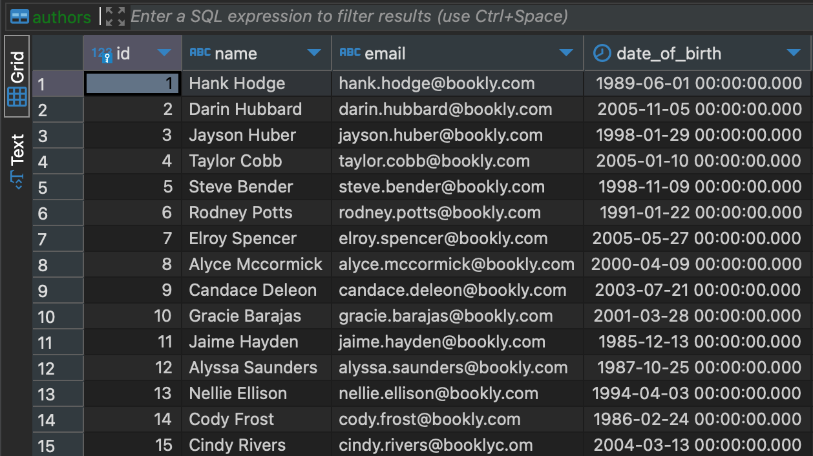
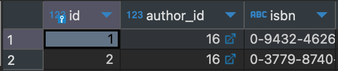
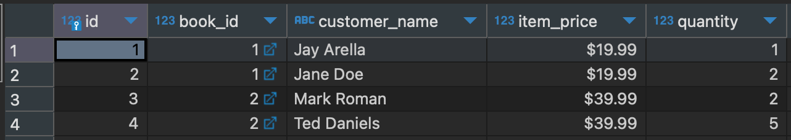

## Krikey Code Challenge

### Part 1: SQL Challenge

Assuming the following tables are created:

```sql
CREATE TABLE authors (
id serial PRIMARY KEY,
name text,
email text,
date_of_birth timestamp
);

CREATE TABLE books (
id serial PRIMARY KEY,
author_id integer REFERENCES authors (id),
isbn text,
);

CREATE TABLE sale_items (
id serial PRIMARY KEY,
book_id integer REFERENCES books (id),
customer_name text,
item_price money,
quantity integer
);
```

Write SQL statements for the following:

### 1. Who are the first 10 authors ordered by date_of_birth?

In order to solve this problem, I first created my own Postgres database to use as a sandbox. I created the database with Docker using `backend/db/docker-compose.yml`.

```
# Use krikey_user/r@nd0mv@lu3 user/password credentials
version: "3.9"

services:
  krikeydb:
    image: postgres
    restart: always
    shm_size: 128mb
    ports:
      - 5432:5432
    environment:
      POSTGRES_PASSWORD: r@nd0mv@lu3
      POSTGRES_USER: krikey_user
      POSTGRES_DB: krikey_db

```

I then manually executed the SQL statement above. I used DBeaver to add rows to each table, first adding 15 authors (using random name and birthday generators I found online).



From there, I landed on using this SQL statement to get `the first 10 authors order by date_of_birth` (executing it through DBeaver).

```sql
select *
from authors
order by date_of_birth asc
limit 10
```

The above statement orders by date_of_birth in ascending order. To get the first 10 authors in descending order, you can use this statement:

```sql
select *
from authors
order by date_of_birth desc
limit 10
```

### 2. What is the sales total for the author named “Lorelai Gilmore”?

For this question, I created a new author row with name "Lorelai Gilmore" (nice Gilmore Girls reference!). I also added her fictional birthday. I then added 2 rows for books, setting Lorelai as the author. Finally, I added 4 rows for sale_items (basically 2 sales per book).





My next step was to create a join that returns the author of the book of each sale item. I landed on this query:

```sql
select t1.*, t3.name
from sale_items t1
inner join books t2 on t1.book_id = t2.id
inner join authors t3 on t2.author_id =t3.id
```

Which returned the following response:

```sql
id book_id name item_price quantity name
1	1	Jay Arella	$19.99	1	Lorelai Gilmore
2	1	Jane Doe	$19.99	2	Lorelai Gilmore
3	2	Mark Roman	$39.99	2	Lorelai Gilmore
4	2	Ted Daniels	$39.99	5	Lorelai Gilmore
```

Which still wasn't quite right. We need the total of all the sales for Lorelai. I then turned to using `group by` to group the rows by author name.

```sql
select sum(t1.item_price), t3.name
from sale_items t1
inner join books t2 on t1.book_id = t2.id
inner join authors t3 on t2.author_id =t3.id
group by t3.name
```

This yielded me the following results:

```sql
sum name
$119.96	Lorelai Gilmore
```

Almost there. The sum doesn't take the quantity into account. Multiplying quantity by item_price before summing it all up looks like this:

```sql
select sum(t1.item_price * t1.quantity), t3.name
from sale_items t1
inner join books t2 on t1.book_id = t2.id
inner join authors t3 on t2.author_id =t3.id
group by t3.name
```

Which finally yields this:

```sql
sum name
$339.90	Lorelai Gilmore
```

Which is the value that I expected.

**TLDR;**

```sql
select sum(t1.item_price * t1.quantity), t3.name
from sale_items t1
inner join books t2 on t1.book_id = t2.id
inner join authors t3 on t2.author_id =t3.id
group by t3.name
```

### 3. What are the top 10 performing authors, ranked by sales revenue?

I can leverage the SQL statement I came up with for question 2 to get the top 10 performing authors by sales revenue.

I added a name to the sum like this:

```sql
select sum(t1.item_price * t1.quantity) as sales_revenue
```

Then I added an `order by` at the end of the statement like this:

```sql
order by sales_revenue desc
```

And finally, I added a `limit` to the end of the query:

```sql
limit 10
```

Altogether, the SQL statement looks like this:

```sql
select sum(t1.item_price * t1.quantity) as sales_revenue, t3.name as author_name
from sale_items t1
inner join books t2 on t1.book_id = t2.id
inner join authors t3 on t2.author_id =t3.id
group by author_name
order by sales_revenue desc
limit 10
```

After adding a few more books and sale_items, this is an example response.

```sql
sales_revenue author_name
$1,118.88	Gracie Barajas
$536.00	Alyce Mccormick
$375.00	Rodney Potts
$339.90	Lorelai Gilmore
$159.98	Taylor Cobb
$119.97	Jayson Huber
$79.99	Hank Hodge
$79.96	Darin Hubbard
$48.00	Elroy Spencer
$39.98	Steve Bender
```
