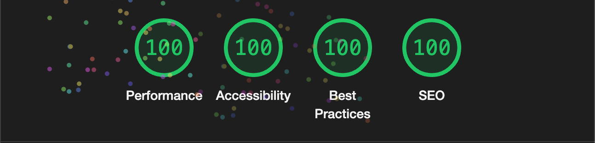

## Krikey Code Challenge

### Part 3: Build & Deploy Webpage

I opted to build the frontend with Next.js. Because I'm using raw CSS via CSS module, I didn't need to import any additional dependencies. The only dependencies imported are the ones included from Next.js

With Next.js, you can fetch data server side and send down the fully loaded markup on first load. In my implementation, there's no additional JavaScript executed client side once it's loaded.

The added benefits of this approach are:

1. High Lighthouse scores
2. If this page was intended to be public facing, it would rank well for SEO because the entire markup is ready for the search engine scrapers
3. Simple deployment to Vercel. You can also opt to deploy it like any other Node app.

### Lighthouse scores

The app hits 100 on all Lighthouse score metrics for both mobile and desktop on the deployed app: [https://author-list.vercel.app/](https://author-list.vercel.app/)

This score is also reflected on PageSpeed Insights: https://pagespeed.web.dev/analysis/https-author-list-vercel-app/utucqtoxzw?form_factor=mobile

### How to deploy

For simplicity, I opted to deploy the app like this:

1. Spin up a Postgres instance using [Railway.app](https://railway.app/). Use the `dump.sql` found in `/backend/db/dump.sql` to create the tables and seed the data.

- Once this is set up, grab the connection string and use it in the next step.

2. Spin up a Node deployment in [Railway.app](https://railway.app/) by connecting the GitHub repo and pointing the root directory to `/backend`. Add the connection string found in Step 1 as the environment variable `DB_CONNECTION_STRING`.

- Enable public networking and then visit the public URL. In my case, it was: https://author-list-production.up.railway.app. Visiting should show a `Hello world!`.

3. Spin up a Next.js deployment in [Vercel](https://vercel.com/) by connecting the GitHub repo and pointing the root directory to `/frontend`. Add the environment variable `BACKEND_ORIGIN` and give it the value of the public URL you were assigned in Step 2.

Once that's done, you should have a fully working frontend and backend deployed.

### Deployed URLs

Visit the deployed frontend: https://author-list.vercel.app/

Visit the deployed backend: https://author-list-production.up.railway.app/authors

Visit the deployed swagger docs: https://author-list-production.up.railway.app/api-docs
