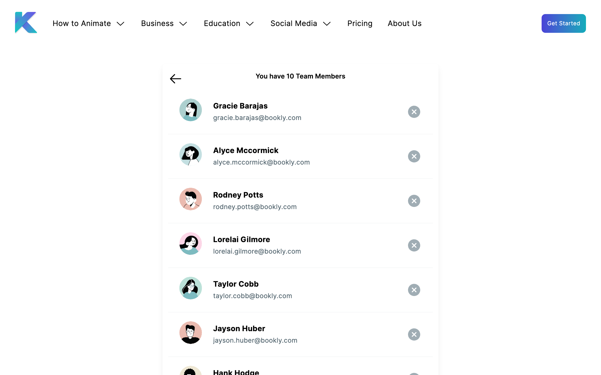

# Author List Frontend

A frontend app that renders the top 10 best selling authors.

## Description

This app was built with React/Next.js, raw CSS (via CSS modules), and written in TypeScript. It fetches the top 10 best selling authors from the backend within a React server component (meaning that it fetches server side from Next.js). The entire markup is sent through the initial response. The UI is also responsive across mobile, tablet, and desktop screens.

## Getting Started

### Run Locally

#### Dependencies

- Node v20
- Docker (optional)
- Docker Compose (optional)

### Installing

```sh
npm install
```

### Set up environment variables

Before running the program, create a .env. You can do that quickly for development like this:

```sh
cat .env.example >> .env
```

### Executing the program

To run the program in dev mode

```sh
npm run dev
```

And visit http://localhost:3000 to get the homepage that displays the top 10 best selling authors.
